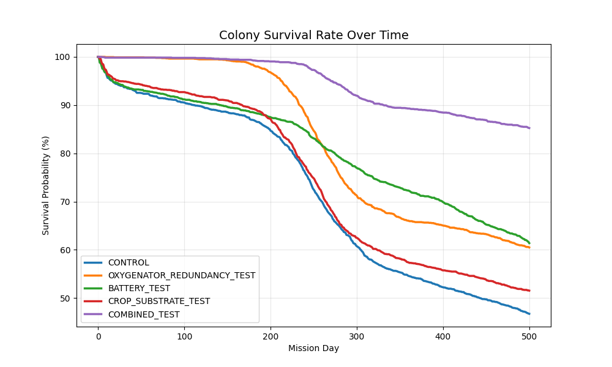
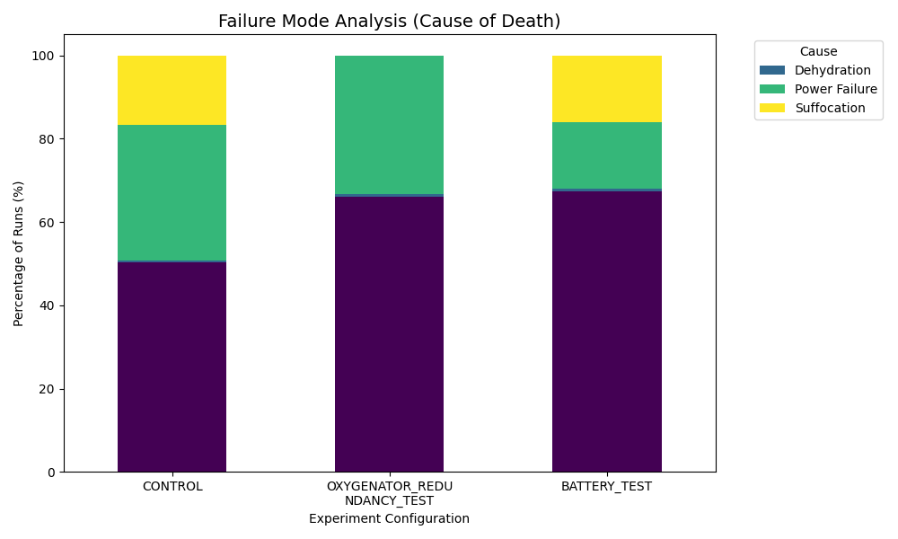
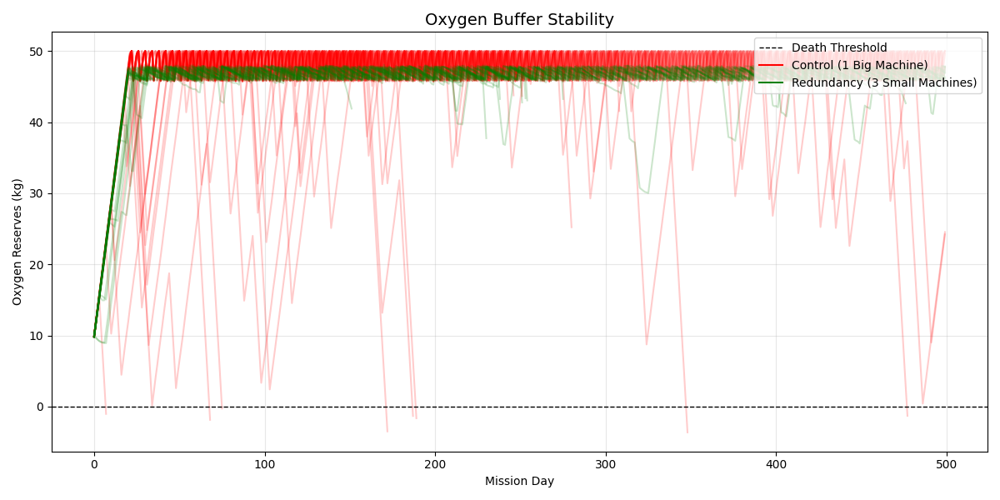
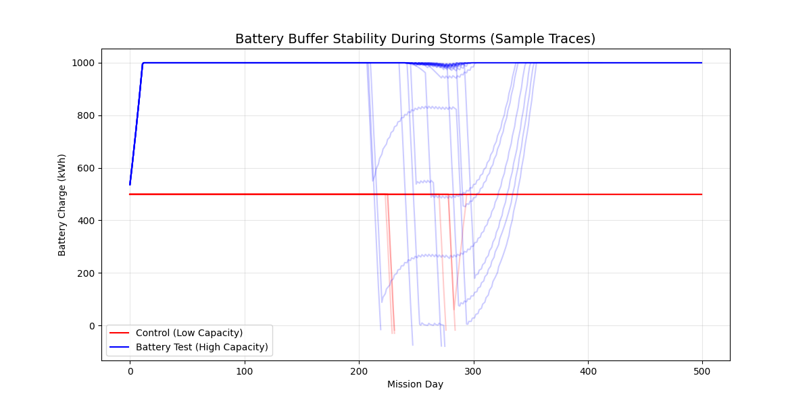

# Reliability Analysis of a Closed-Loop Martian Life Support System

**Author**: Zong-Hua Wu

**NetID**: zonghua2


## Overview

A Monte Carlo simulation project designed to model the survivability of a 6-person Martian colony over a 500-day mission.

Unlike standard resource management games, this project models the complex dependencies between electrical power, life support (ECLSS), and biological systems. It tests three major architectural hypotheses: Redundancy (spare machines), Energy Buffering (batteries vs. solar), and Biological Resilience (soil vs hydroponics). when facing stochastic risks like dust storms and mechanical failures.


## Inspiration

This project was originally inspired by the mechanics of Fallout Shelter, but pivoted to focus on the constraints of real-world spaceflight. Instead of optimizing for "happiness," this project optimizes for mass efficiency and reliability, utilizing data from NASA's Environmental Control and Life Support Systems (ECLSS).


## Phase 1: The Model

The simulation tracks the daily status of Oxygen, Water, Food, and Power. It utilizes a Closed-Loop System where waste water is recycled, and power generation drives life support.

### Deterministic Variables
- Mission Members: 6 crew members
- Mission Duration: 500 days
- Consumption: Oxygen, water, and calorie consumption based on NASA "Baseline Values for Human Space Flight"
- Power Load: for oxygenator, water reclaimer, and other base systems

### Stochastic Variables (The Risks)

| Variable | Model Used | Description |
| :- | :- | :- |
| Mechanical Failure | Exponential Distribution | Modeled using Mean Time Between Failures (MTBF). |
Repair Time | Log-Normal Distribution | Repairs are usually fast, but have a "long tail" representing catastrophic diagnostics. |
Martian Weather | Beer-Lambert / Markov | Simulates Solar Longitude (Ls) to create "Clear" and "Dusty" seasons, plus stochastic Global Dust Storms. |
Crop Production | Normal Distribution | Simulates biological variability in food and oxygen production. |


## Phase 2: Experiments & Hypotheses

Ran 2000 Monte Carlo simulations for three distinct experiments.

### The Control Group (Baseline)
- **Setup**: 1 Large Oxygenator, Standard Battery, Standard Solar.
- **Purpose**: Baseline for failure rates under normal Martian conditions.

### Hypothesis 1: The Redundancy Test
- **Question**: Is it safer to have one high-output machine or three lower-output machines?
- **Hypothesis**: The distributed system (3 units) will result in higher survival because it avoids "Zero-Production Days."
- **Implementation**: Replaced 1 Large Oxygenator with 3 Small ones (total capacity matched).

### Hypothesis 2: The Battery Test
- **Question**: Given a fixed mass budget, is it better to maximize Solar Power (Generation) or Battery Buffer (Storage)?
- **Hypothesis**: Due to the stochastic nature of storms, Storage > Generation. Bringing more batteries will yield higher survival rates than more solar panels.
- **Implementation**: Reduced Solar Capacity to fund a massive Battery Bank increase.

### Hypothesis 3: The Substrate Resilience Test
- **Question**: prioritize high-yield hydroponics (plants grow in water) or resilient soil-based (plants grow in Martian regolith mixed with compost) farming when facing unreliable power supply?
- **Hypothesis**: "Despite lower daily food production, Soil-Based farming will result in a higher survival rate than Hydroponics because its passive moisture retention prevents catastrophic crop die-offs during power failures"
- **Implementation**: Reduced Crop Production Rate by 20% but improved Crop Drought Resistance (Decay Rate reduced from 0.3 to 0.05).


## Phase 3: Results & Conclusions

Here's a sample run of 1,000 Monte Carlo simulations for three experiment types:

```terminal
--- Starting Experiment: CONTROL ---
Simulations: 2000
Success Rate: 46.75%
Failure Causes: {'Suffocation': 380, 'Starvation': 156, 'Power Failure': 500, 'Dehydration': 29}

--- Starting Experiment: OXYGENATOR_REDUNDANCY_TEST ---
Simulations: 2000
Success Rate: 60.50%
Failure Causes: {'Suffocation': 3, 'Starvation': 190, 'Power Failure': 563, 'Dehydration': 34}

--- Starting Experiment: BATTERY_TEST ---
Simulations: 2000
Success Rate: 61.40%
Failure Causes: {'Suffocation': 390, 'Starvation': 210, 'Power Failure': 131, 'Dehydration': 41}

--- Starting Experiment: CROP_SUBSTRATE_TEST ---
Simulations: 2000
Success Rate: 51.55%
Failure Causes: {'Suffocation': 334, 'Starvation': 38, 'Power Failure': 522, 'Dehydration': 75}

--- Starting Experiment: COMBINED_TEST ---
Simulations: 2000
Success Rate: 85.25%
Failure Causes: {'Suffocation': 3, 'Starvation': 55, 'Power Failure': 155, 'Dehydration': 82}
```

### Conclusion 1: Redundancy Eliminates "Sudden Death"
Hypothesis Supported. In the Control group, a single point failure often led to death before repairs could be finished (Suffocation). In the Redundancy Test, Suffocation deaths dropped to nearly zero. The redundancy architecture successfully converted fatal single point failures into manageable stress events, allowing the colony to limp along until repairs were made.

### Conclusion 2: Buffers Beat Generation
Hypothesis Supported. The Control group frequently died during dust storms lasting >6.5 days. The Battery Test group, despite having lower daily power generation, survived storms lasting up to 13 days. The data suggests that endurance (batteries) is more valuable than peak capacity (solar panels) due to the stochastic nature of storms (note that storms last 5-15 days).

### Conclusion 3: Soil Beats Hydroponics
Hypothesis Supported. Starvation deaths dropped significantly. The Control group's hydroponic crops frequently died entirely during power outages (crops die in 3 days without water), leading to starvation weeks later. The soil-based crops, despite lower daily production, survived the outages and recovered, keeping the crews alive.

### Visualizations

Colony Survival Rate Over Time



Failure Mode Analysis (Cause of Death)



Oxygen Buffer Stability



Battery Buffer Stability During Storms




## Getting Started

### Prerequisites
- Python 3.8+
- numpy
- pandas
- matplotlib
- pillow

```shell
pip install numpy pandas matplotlib pillow
```

### Installation

```shell
git clone https://github.com/leowu82/mars-sim.git
cd mars-sim
```

### Directory Structure

```
mars-sim/
├── main.py           # Entry point (runs the experiments)
├── config.py         # Simulation constants & hypothesis settings
├── models.py         # Physical models (Machine, Crops, Environment)
├── simulation.py     # Core logic (MarsColony class)
├── visualization.py  # Plotting functions
└── README.md
```

### Run

```shell
python main.py
```


## Academic Context & Scope

While this project is an original implementation, it explores concepts similar to advanced aerospace reliability studies, such as the analysis of the [Lunar Palace 1 bioregenerative system](https://www.researchgate.net/publication/365377952_Reliability_and_lifetime_estimation_of_bioregenerative_life_support_system_based_on_370-day_closed_human_experiment_of_lunar_palace_1_and_Monte_Carlo_simulation)
(utilizes Monte Carlo methods to estimate system lifetimes based on 370 days of closed-loop human experiments). The main distinction between these two:

- **Existing Research (Lunar Palace 1)**: Focuses on high granular modeling of specific components, biological conversion rates, and data from physical testbeds.

- **My Project**: A simplified conceptual model. Focuses on high-level system interactions to explore architectural trade-offs (Redundancy vs. Buffering) rather than component-level physics.


## References
    
- Gemini to help me understand water systems and food production in long-term space expeditions
    
    [Gemini Chat Log](https://gemini.google.com/share/84ebda2d5189)
    
- NASA Environmental Control & Life Support System (ECLSS): Human-Centered Approach
    
    [www.nasa.gov](https://www.nasa.gov/wp-content/uploads/2023/07/eclss-technical-brief-ochmo.pdf)
    
- NASA Water – Human Consumption
    
    [www.nasa.gov](https://www.nasa.gov/wp-content/uploads/2023/12/ochmo-tb-027-water.pdf)
    
- NASA Water Recycle System Study
    
    [NASA Achieves Water Recovery Milestone on International Space Station](https://www.nasa.gov/missions/station/iss-research/nasa-achieves-water-recovery-milestone-on-international-space-station/)
    
- Mars Climate
    
    [gemelli.colorado.edu](https://gemelli.colorado.edu/~lmontabone/Montabone_et_al_2015.pdf)
        
- Python guidance (gemini)
    
    [Gemini Chat Log](https://gemini.google.com/share/6e3bb793aeb5)
